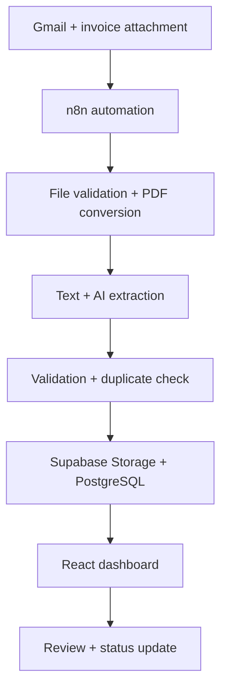
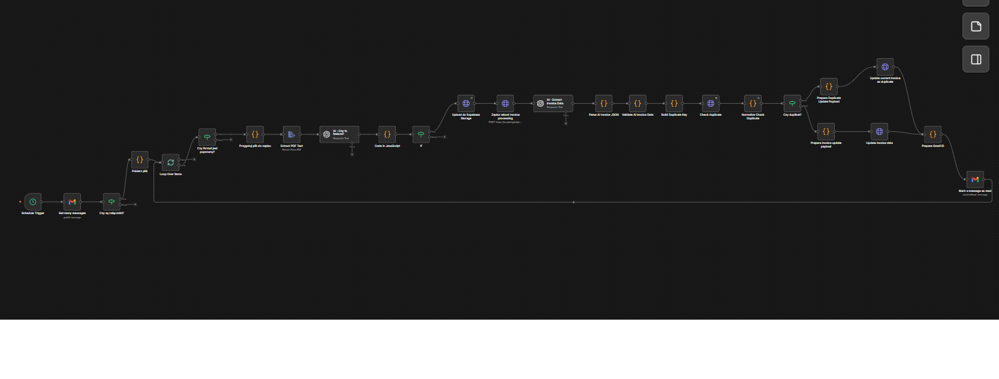

# InvoiceFlow

AI-assisted invoice processing system built with React, Supabase and n8n. It collects invoice attachments from Gmail, converts supported files to PDF, extracts and validates their data, detects duplicates and exposes the results in a real-time management dashboard.

## Features

- automated Gmail attachment intake and conversion to PDF
- AI-powered invoice data extraction and validation
- duplicate and missing-data detection
- Supabase authentication, database, Storage and Realtime
- secure PDF preview through signed URLs
- search, filters, status management and financial KPIs
- rule-based invoice risk indicators

## Architecture



The n8n workflow processes unread messages with attachments, verifies the file format, converts supported documents to PDF, extracts structured invoice data, validates required fields, checks for duplicates, creates or updates the Supabase record and marks the email as read.



## Tech stack

| Layer | Technologies |
| --- | --- |
| Frontend | React 19, Vite, JavaScript, Framer Motion |
| Backend | Supabase Auth, PostgreSQL, Realtime, Storage |
| Automation | n8n, Gmail, file-to-PDF conversion, PDF text extraction |
| AI | OpenAI structured invoice extraction |

## Local setup

Requirements: Node.js `20.19+` or `22.12+`, npm, a configured Supabase project and access to the n8n workflow.

```bash
git clone https://github.com/Mantini94/invoiceflow.git
cd invoiceflow
npm install
npm run dev
```

## Demo access

```text
Email:    test123@wububu.com
Password: elo123
```

This account is intended only for testing the application.

The application expects an `invoices` table, an `invoice-files` Storage bucket and Supabase Auth users. Supabase client configuration is currently defined in `src/lib/supabase.js`; n8n credentials and workflow configuration are managed separately in n8n.

## Author

Built by Marcin Żak.